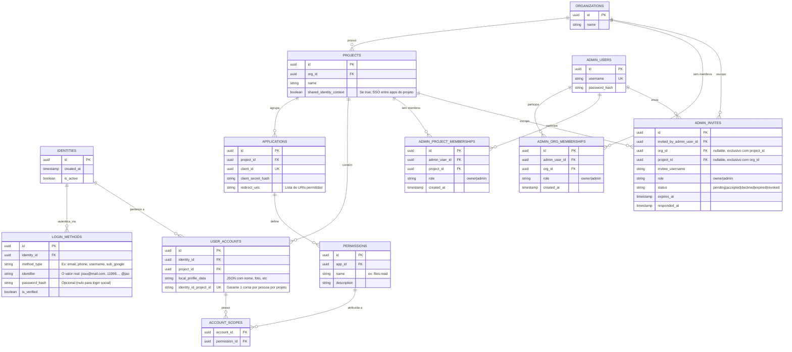

```mermaid
erDiagram
    IDENTITIES ||--o{ LOGIN_METHODS : "autentica_via"
    IDENTITIES ||--o{ USER_ACCOUNTS : "pertence a"
    ORGANIZATIONS ||--o{ PROJECTS : "possui"
    PROJECTS ||--o{ APPLICATIONS : "agrupa"
    PROJECTS ||--o{ USER_ACCOUNTS : "contém"
    APPLICATIONS ||--o{ PERMISSIONS : "define"
    USER_ACCOUNTS ||--o{ ACCOUNT_SCOPES : "possui"
    PERMISSIONS ||--o{ ACCOUNT_SCOPES : "atribuída a"
    ADMIN_USERS ||--o{ ADMIN_ORG_MEMBERSHIPS : "participa"
    ORGANIZATIONS ||--o{ ADMIN_ORG_MEMBERSHIPS : "tem membros"
    ADMIN_USERS ||--o{ ADMIN_PROJECT_MEMBERSHIPS : "participa"
    PROJECTS ||--o{ ADMIN_PROJECT_MEMBERSHIPS : "tem membros"
    ADMIN_USERS ||--o{ ADMIN_INVITES : "envia"
    ORGANIZATIONS ||--o{ ADMIN_INVITES : "escopo"
    PROJECTS ||--o{ ADMIN_INVITES : "escopo"

    IDENTITIES {
        uuid id PK
        timestamp created_at
        boolean is_active
    }

    LOGIN_METHODS {
        uuid id PK
        uuid identity_id FK
        string method_type "Ex: email, phone, username, sub_google"
        string identifier "O valor real: joao@mail.com, 11999..., @jao"
        string password_hash "Opcional (nulo para login social)"
        boolean is_verified
    }

    ORGANIZATIONS {
        uuid id PK
        string name
    }

    PROJECTS {
        uuid id PK
        uuid org_id FK
        string name
        boolean shared_identity_context "Se true, SSO entre apps do projeto"
    }

    APPLICATIONS {
        uuid id PK
        uuid project_id FK
        uuid client_id UK
        string client_secret_hash
        string redirect_uris "Lista de URIs permitidas"
    }

    USER_ACCOUNTS {
        uuid id PK
        uuid identity_id FK
        uuid project_id FK
        string local_profile_data "JSON com nome, foto, etc"
        string identity_id_project_id UK "Garante 1 conta por pessoa por projeto"
    }
    
    PERMISSIONS {
        uuid id PK
        uuid app_id FK
        string name "ex: files:read"
        string description
    }

    ACCOUNT_SCOPES {
        uuid account_id FK
        uuid permission_id FK
    }

    ADMIN_USERS {
        uuid id PK
        string username UK
        string password_hash
    }

    ADMIN_ORG_MEMBERSHIPS {
        uuid id PK
        uuid admin_user_id FK
        uuid org_id FK
        string role "owner|admin"
        timestamp created_at
    }

    ADMIN_PROJECT_MEMBERSHIPS {
        uuid id PK
        uuid admin_user_id FK
        uuid project_id FK
        string role "owner|admin"
        timestamp created_at
    }

    ADMIN_INVITES {
        uuid id PK
        uuid invited_by_admin_user_id FK
        uuid org_id FK "nullable, exclusivo com project_id"
        uuid project_id FK "nullable, exclusivo com org_id"
        string invitee_username
        string role "owner|admin"
        string status "pending|accepted|declined|expired|revoked"
        timestamp expires_at
        timestamp responded_at
    }
```